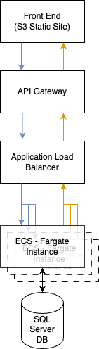

# AWS Terraform Deployment Environment
This AWS environment is designed to provide a standard set of features to get you in deploying an application on AWS. This terraform package is designed to give you everything you need to deploy a stable, redundant application in multiple environments to allow for proper isolation of development work from your production application. It is also designed to have pathways and methods for assisting investigation of issues with your application once it is deployed.

## High Level Architecture
The below diagram is a capture of the data flow provided by the infrastructure included in this repository.


A user will access the static front end via a web facing S3 Bucket (With certificates managed by CloudFront Distributions). That site will direct API requests to the public internet facing API Gateway (This manages certificates for the API Backend). The API gateway serves as a proxy to route traffic to an Application Load Balancer which then directs traffic to healthy ECS Fargate instances which have access via the private subnet and security groups to the SQL Server hosted database.

There are additional features and functionality not featured in this diagram that are described later in this document.

## Setup
There are several steps to be performed prior to first deployment of an environment.

### AWS Account
You will need an AWS Account and a user with appropriate access in order to deploy this infrastructure. Once you've create an account you will need to select the region for your application. I recommend any region other than us-east-1 as it's the *default* region and has the highest competition for resources.

In order to run this you will need command line access to AWS. To do this you will need to grant programmatic access to your AWS account. [Instructions](https://docs.aws.amazon.com/workspaces-web/latest/adminguide/getting-started-iam-user-access-keys.html) If you already have programmatic access with greater access than is required for this deployment, feel free to use that instead.

Once you have programmatic access make sure to install the AWS CLI and [configure](https://docs.aws.amazon.com/cli/latest/userguide/getting-started-quickstart.html) it with the programmatic access you created above. 

### AWS Resource Access
In order to create this environment you resource described above will need at least the permissions described below. When setting up programmatic access make sure you have the following permissions.
This is also a useful starting point for creating permissions for any continuous integration functionality you may wish to deploy.

#### Minimum Policy to Deploy this Environment
Below are two example policies for setting up and deleteing this envioronment. It is recommended to set up the resources on the policies to specifically match your implementations, especially the delete policies.

##### Set-Up Policy
```json
{
    "Version": "2012-10-17",
    "Statement": [
        {
            "Effect": "Allow",
            "Action": [
                "kms:CreateKey",
                "kms:PutKeyPolicy",
                "kms:TagResource",
                "kms:DescribeKey",
                "kms:GetKeyPolicy",
                "cloudfront:CreateOriginAccessControl",
                "kms:GetKeyRotationStatus",
                "cloudfront:GetOriginAccessControl",
                "kms:ListResourceTags",
                "ec2:AllocateAddress",
                "ec2:CreateTags",
                "ec2:DescribeAddresses",
                "ecs:CreateCluster",
                "ecs:RegisterTaskDefinition",
                "ecs:DescribeTaskDefinition",
                "ec2:CreateVpcEndpoint",
                "route53:AssociateVPCWithHostedZone",
                "ec2:DescribeVpcs",
                "ec2:CreateSubnet",
                "ec2:DescribeSubnets",
                "ec2:ModifySubnetAttribute",
                "ec2:DescribeVpcEndpoints",
                "ec2:DescribePrefixLists",
                "ec2:CreateInternetGateway",
                "ec2:AttachInternetGateway",
                "ec2:DescribeInternetGateways",
                "elasticloadbalancing:DescribeTargetGroups",
                "elasticloadbalancing:CreateTargetGroup",
                "elasticloadbalancing:AddTags",
                "elasticloadbalancing:ModifyTargetGroupAttributes",
                "elasticloadbalancing:DescribeTargetGroupAttributes",
                "elasticloadbalancing:DescribeTags",
                "ecs:DescribeClusters",
                "ec2:CreateSecurityGroup",
                "ec2:DescribeSecurityGroups",
                "ec2:RevokeSecurityGroupEgress",
                "ec2:AuthorizeSecurityGroupIngress",
                "ec2:AuthorizeSecurityGroupEgress",
                "ec2:CreateRouteTable",
                "ecs:PutClusterCapacityProviders",
                "ec2:DescribeRouteTables",
                "ec2:CreateRoute",
                "ec2:CreateNatGateway",
                "ec2:DescribeNatGateways",
                "cloudfront:CreateDistribution",
                "ec2:AssociateRouteTable",
                "elasticloadbalancing:DescribeLoadBalancers",
                "ecs:CreateService",
                "rds:ListTagsForResource",
                "elasticloadbalancing:CreateLoadBalancer",
                "ec2:RunInstances",
                "rds:CreateDBInstance",
                "rds:AddTagsToResource",
                "kms:CreateGrant",
                "kms:Decrypt",
                "kms:GenerateDataKey",
                "rds:CreateTenantDatabase",
                "secretsmanager:CreateSecret",
                "secretsmanager:TagResource",
                "ec2:DescribeInstances",
                "ec2:DescribeInstanceTypes",
                "ec2:DescribeTags",
                "ec2:DescribeInstanceAttribute",
                "ec2:DescribeVolumes",
                "ec2:DescribeInstanceCreditSpecifications",
                "rds:DescribeDBInstances",
                "elasticloadbalancing:ModifyLoadBalancerAttributes",
                "elasticloadbalancing:DescribeLoadBalancerAttributes",
                "ecs:DescribeServices",
                "application-autoscaling:RegisterScalableTarget",
                "application-autoscaling:TagResource",
                "application-autoscaling:DescribeScalableTargets",
                "application-autoscaling:ListTagsForResource",
                "application-autoscaling:PutScalingPolicy",
                "application-autoscaling:DescribeScalingPolicies",
                "ec2:DescribeAvailabilityZones",
                "ec2:CreateVpc",
                "apigateway:POST",
                "logs:CreateLogGroup",
                "ecr:CreateRepository",
                "s3:CreateBucket",
                "ec2:DescribeVpcAttribute",
                "ecr:DescribeRepositories",
                "logs:DescribeLogGroups",
                "s3:ListBucket",
                "apigateway:GET",
                "s3:GetBucketPolicy",
                "ecr:ListTagsForResource",
                "logs:ListTagsLogGroup",
                "s3:GetBucketAcl",
                "s3:GetBucketCORS",
                "s3:GetBucketWebsite",
                "s3:GetBucketVersioning",
                "s3:GetAccelerateConfiguration",
                "s3:GetBucketRequestPayment",
                "s3:GetBucketLogging",
                "s3:GetLifecycleConfiguration",
                "s3:GetReplicationConfiguration",
                "s3:GetEncryptionConfiguration",
                "s3:GetBucketObjectLockConfiguration",
                "s3:GetBucketTagging",
                "s3:PutBucketWebsite",
                "s3:PutBucketPublicAccessBlock",
                "cloudfront:TagResource",
                "rds:CreateDBSubnetGroup",
                "elasticloadbalancing:CreateListener",
                "elasticloadbalancing:DescribeListeners",
                "rds:DescribeDBSubnetGroups",
                "s3:GetBucketPublicAccessBlock",
                "s3:GetBucketLocation",
                "s3:PutBucketPolicy",
                "cloudfront:GetDistribution",
                "cloudfront:ListTagsForResource",
                "cloudfront:UpdateDistribution"
            ],
            "Resource": "*"
        },
        {
            "Effect": "Allow",
            "Action": [
                "iam:CreateRole",
                "iam:CreateServiceLinkedRole",
                "iam:ListRolePolicies",
                "iam:ListAttachedRolePolicies",
                "iam:PassRole",
                "iam:GetRole",
                "iam:ListInstanceProfilesForRole",
                "iam:AttachRolePolicy"
            ],
            "Resource": [
                "arn:aws:iam::*:role/default",
                "arn:aws:iam::*:role/example-ecs-role"
            ]
        },
        {
            "Effect": "Allow",
            "Action": [
                "secretsmanager:DescribeSecret",
                "secretsmanager:GetResourcePolicy",
                "secretsmanager:GetSecretValue"
            ],
            "Resource": [
                "arn:aws:secretsmanager:*:*:secret:example-password-*"
            ]
        }
    ]
}
```
##### Delete Policy
```json
{
    "Version": "2012-10-17",
    "Statement": [
        {
            "Effect": "Allow",
            "Action": [
                "kms:DescribeKey",
                "kms:GetKeyPolicy",
                "kms:GetKeyRotationStatus",
                "kms:ListResourceTags",
                "ec2:DescribeAvailabilityZones",
                "ec2:DescribeAddresses",
                "cloudfront:GetOriginAccessControl",
                "ec2:DescribeVpcEndpoints",
                "ec2:DescribeInternetGateways",
                "ecs:DescribeTaskDefinition",
                "ecs:DescribeClusters",
                "ec2:DescribeSecurityGroups",
                "elasticloadbalancing:DescribeTargetGroups",
                "ec2:DescribeSubnets",
                "elasticloadbalancing:DescribeTargetGroupAttributes",
                "ec2:DescribePrefixLists",
                "elasticloadbalancing:DescribeTags",
                "ec2:DescribeRouteTables",
                "ec2:DescribeNatGateways",
                "elasticloadbalancing:DescribeLoadBalancers",
                "ecs:DescribeServices",
                "ec2:DescribeInstances",
                "elasticloadbalancing:DescribeLoadBalancerAttributes",
                "ec2:DescribeInstanceTypes",
                "ec2:DescribeTags",
                "ec2:DescribeVpcs",
                "application-autoscaling:DescribeScalableTargets",
                "application-autoscaling:ListTagsForResource",
                "ec2:DescribeInstanceAttribute",
                "rds:ListTagsForResource",
                "application-autoscaling:DescribeScalingPolicies",
                "ec2:DescribeVolumes",
                "rds:DescribeDBInstances",
                "ec2:DescribeInstanceCreditSpecifications",
                "ec2:DescribeNetworkInterfaces",
                "ec2:DeleteVpcEndpoints",
                "ec2:ModifyInstanceAttribute",
                "ec2:DeleteSecurityGroup",
                "application-autoscaling:DeleteScalingPolicy",
                "ec2:TerminateInstances",
                "cloudfront:DeleteOriginAccessControl",
                "ecs:PutClusterCapacityProviders",
                "rds:DeleteDBInstance",
                "rds:DeleteTenantDatabase",
                "application-autoscaling:DeregisterScalableTarget",
                "ecs:UpdateService",
                "ecs:DeleteService",
                "elasticloadbalancing:DeleteLoadBalancer",
                "ec2:DetachNetworkInterface",
                "ecs:DeleteCluster",
                "ecs:DeregisterTaskDefinition",
                "elasticloadbalancing:DeleteTargetGroup",
                "kms:ScheduleKeyDeletion",
                "ec2:DisassociateRouteTable",
                "ec2:DeleteRouteTable",
                "ec2:DeleteSubnet",
                "ec2:DetachInternetGateway",
                "ec2:DeleteNatGateway",
                "s3:DeleteBucket",
                "logs:DeleteLogGroup",
                "ec2:DeleteVpc",
                "apigateway:DELETE",
                "ecr:DeleteRepository",
                "elasticloadbalancing:DeleteListener",
                "s3:DeleteBucketWebsite",
                "rds:DeleteDBSubnetGroup",
                "cloudfront:DeleteDistribution",
                "s3:DeleteObject",
                "s3:DeleteAccessPointPolicy",
                "s3:DeleteBucketPolicy",
                "ec2:DisassociateAddress",
                "ec2:DeleteInternetGateway",
                "ec2:ReleaseAddress"
            ],
            "Resource": "*"
        },
        {
            "Effect": "Allow",
            "Action": [
                "iam:DeleteRole",
                "iam:DetachRolePolicy"
            ],
            "Resource": [
                "arn:aws:iam::*:role/example-ecs-role"
            ]
        }
    ]
}
```

### S3 Bucket
Once you create an AWS Account it is recommended to use that S3 Bucket to store your application deployment there. To do this create a bucket in the AWS region you will be using for your application.
[Instructions](https://docs.aws.amazon.com/AmazonS3/latest/userguide/creating-bucket.html)

### Database Password
In order to keep your database secure it is recommended to use AWS Secrets Manager to manage the password. This will allow you to limit admin access to the database to only those who absolutely need it. To facilitate this a small terraform package has been included for the creation of a random password.

This package is designed to be used to create the password. If it needs to be deleted in the future it can be deleted manually so we skip over some of the more advanced terraform steps. See the README.md file in this directory for details on its use.

### Terraform
Install terraform to your development computer. [Instructions](https://developer.hashicorp.com/terraform/tutorials/aws-get-started/install-cli)

Your environment will need to be initialized. To do that execute the following command from the directory containing the `main.tf` file checked out from this repo.:
```shell
terraform init -backend-config="key={environment-name}.tfstate"
```

### Variable/Configuration File
In order to facilitate multiple environments you it is recommended to use a variable file to store configuration details. Create a file in the `configuration` directory named `{environment}.tfvars`.

Define the following variables:
 - aws_region
 - operator_cidr
     - This is the address you will use to connect to a debug instance.
 - environment
 - ecs{enabled=[true/false]}
     - This value determines wether the ECS Fargate environment will be set up.
 - ec2{enabled=[true/false]}
     - This value determines wether the EC2 Development environment will be set up.

Any remaining variables will be defined in the following steps.

### SSH Key
In order to use the EC2 instances created by this process you will want to create a SSH keys to access your instance. Because these are your secure credentials for accessing your resources it is recommended to create these outside of the automate process to prevent misuse.

[Instructions for creating SSH Keys for EC2 Usage](https://docs.aws.amazon.com/AWSEC2/latest/UserGuide/create-key-pairs.html)

Once you have the name of your key, make sure to update it in the `key_name` value `configuration/{environment}.tfvars` file.

### SSL Certificate Configuration
AWS will create certificates for any domain you own. To do so, set up an RSA 2048 certificate in AWS Certifcate Manager. [Instructions](https://docs.aws.amazon.com/acm/latest/userguide/gs-acm-request-public.html). Once you have a certificate copy the ARN from the console page and update your `configuration/{environment}.tfvars` file to include this as the `cert_arn`.

Additionally, in order to use a custom domain name, update the `domain_name` field in `configuration/{environment}.tfvars`.

## Getting Started With Terraform
Once you have installed terraform and initialized the environment you can see what changes will be made by running the command `terraform plan -var-file config/{var_file_name}.tfvars -out {environment_name}.plan`. This will provide a detailed list of all of the changes which will be made as part of the update.

To deploy these changes to your cloud environment run the command `terraform apply {environment_name}.plan` using the file you created with the terraform plan step above.

If you ever need to add or remove modules from your terraform package you will need to run the `terraform init` command again to update the module reference.

## AWS Implementation and Features
### Virtual Private Cloud
The Virtual Private Cloud is the network which allows all of your AWS resources to communicate directly with each other. This is a shared networking environment which allows various resources to easily communicate using network traffic without needing to expose all resources to the public internet. These resources are partitioned into two groups public, resources which can be accessed via the internet and by other internet connected devices, and private, resources which can only be accessed by other devices within the VPC.
#### Subnets
We have partitioned two default subnet types, public and private. The public subnets are configured to allow the creation of resources with internet facing components to assist in development and debugging of the application. The private subnet is constructed to limit access to critical resources (such as databases) to prevent improper use or destruction of critical infrastructure.
#### Routing Tables
Routing tables are used to configure the flow of traffic from one network to another. We have configured the public subnet to route all VPC traffic within the VPC (both public and private subnets) as well as to the internet.

#### NAT Gateway
This is the resource that allows your private resources to access the internet. In the case where the NAT Gateway becomes a predominant expense on your AWS account you can set up an EC2 instance with wireguard to serve as a NAT Gateway to help normalize cost.

#### Internet Gateway
This is the resource that allows your public resources to be accessed via the internet.

#### VPC Endpoints
In order to minimize cost frequently accessed AWS resources should be added as VPC Endpoints. Each time you interface with an AWS feature the application will use the "fastest" way to reach that service. Without VPC endpoints this will end up using your NAT gateway. If you store data in S3, pull containers, or query a database these endpoints will be important to optimizing your expenses.

The following endpoints have been created:
- S3
- RDS
- ECR
- Secrets Manager

### EC2
This default environment creates a public and private EC2 instance to allow access to your AWS resources for development and debugging. These instances use a 2023 Amazon Linux build as their default operating system. You can read more about Amazon Linux here: [Amazon Linux 2023](https://aws.amazon.com/linux/amazon-linux-2023/features/)

#### Security Groups
The default security groups are configured to allow access from the IP address you provided as the `operator_cidr` variable during deployment. If you need to update those values follow the instructions below.

#### Connecting to EC2 Instances
The Public instance is accessible via ssh using the key you created earlier and passed in as the `key_name` variable during deployment. As a team grows it is recommended that individual keys are required and that debug instances are not enabled/created automatically during deployments and that the EC2 portion of this document becomes configurable.

Additionally, instances can be manually launched using the AWS CLI and AWS Console. See below for instructions.

### RDS
AWS offers the ability to host your database infrastructure on a configurable cloud hosted database. This platform configuration contains two options, a traditional self-managed database to be used for development and investigating application functionality, and another used for a production in an AWS Aurora configuration.

#### Security Groups
The RDS security group restricts database access to internal instances only.

#### Dev vs Production Launch Functionality
The RDS options allow for launching a database to meet your applications needs. These are managed by a variable in the configuration file var.db.sqlsvr.dev and var.db.sqlsvr.prod. These boolean variables enable a single az (dev) or multi-az (prod) with dev using a smaller resource footprint to save cost during development.

### S3
AWS offers object storage. As part of this infrastructure package we create a bucket for each environment. AWS requires each bucket to have a fully unique name. To handle this the bucket created uses the format {environment-name}-{random 12 char sequence}. This bucket is only created the first time and will persist as long as the terraform resources are not destroyed.
#### Static Site Hosting
AWS S3 allows for cost effective static site hosting. In order to also support SSL certificates we have added functionality using CloudFront distributions which can manage SSL certificates created by the AWS certificate manager.

### Container Service
In order to handle scalability and redundancy of our application we launch using [AWS ECS Fargate](https://docs.aws.amazon.com/AmazonECS/latest/developerguide/AWS_Fargate.html) The configuration provided here is a minimum environment designed to demonstrate the multi-availability zone functionality. You will likely need to tailor the CPU and Memory usage of the Fargate resources by updating the `aws_ecs_task_definition` within the `container_service.tf` file to meet the needs of your application.

#### Auto-Scaling
This package also includes an example auto scaling configuration which will add or remove instances based on the amount of outstanding traffic. This is designed to help mitigate surges in traffic but it is recommended you tune this functionality to better align with the behavior of your application. Currently resources are added or removed based on the number of outstanding requests for each target.

### Load Balancers
The Application Load Balancer distributes traffic between your ECS Fargate instances. This also helps handle cases where an availability zone or resource is unavailable to keep your API functioning even when a resource is down.

An example alarm function is included here to send an e-mail to the configured recipient when more than 50% of the expected resources are unavailable.

### API Gateway
AWS's API gateway allows public access to your APIs hosted on Private Subnets. The API gateway can also be used to route traffic, validate connections, and filter input to your API. The existing implementation functions only as a routing proxy. Read more about API Gateway functionality [here](https://docs.aws.amazon.com/apigateway/latest/developerguide/welcome.html).

## Containers
Included in this package is a template for a baseline Docker container. This is based on Alpine Linux 3.19.1 (latest at the time of creation of this template) and includes a staged build process to help minimize rebuild times on local resources. More about alpine linux can be found [here](https://www.alpinelinux.org/about/) The focus on this process is to minimize risk by only installing what you need to run your backend application. For details on what pre-built packages are available on Alpine see their [package listing](https://pkgs.alpinelinux.org/packages).

## Getting Started with CI
Included in this package are several templates for getting started with Continuous Integration and Continuous Deployment (CI/CD) of this cloud environment. The templates included assume using github actions but will serve as an example for building scripts for other CI/CD tools.

### AWS IAM Configuration for GitHub Actions
To integrate GitHub Actions with your AWS account. Follow the instructions provided by [AWS](https://aws.amazon.com/blogs/security/use-iam-roles-to-connect-github-actions-to-actions-in-aws/)

### Modifying configuration
In order to manage multiple environments variable configuration files are used. These are captured in the `configuration` directory. An example starting point `dev.tfvars` is included. See below for a description of the variables contained within this file:

### Docker
Following successful unit testing of your application, and successful setup of Dockerfile you can use the `docker-push.yml` GitHub Actions file to regularly upload your application to your cloud repository. This process also includes a built in step to scan the container for vulnerabilities and prevent deployment if risks are found. It is recommended to modify this workflow to fit your needs.

### Terraform
To simplify integration of Terraform into your workflow and improve readability of changes I've included two workflows (`plan-apply-on-merge.yml` and `plan-on-pr.yml`) based on Andrew Walker's Blog Post [Elevate your Terraform Workflow with GitHub Actions](https://blog.testdouble.com/posts/2021-12-07-elevate-your-terraform-workflow-with-github-actions/). This serves as a great starting point for creating an easily reviewabale and automatically deployable cloud infrastructure.

### Static Site
I've included a simple AWS S3 CLI commandlet executed in GitHub actions to sync your static web page to your S3 static location following a merge to an environment branch (`dev/stage/prod/etc.`) This will keep your customer facing deployments current with your latest GitHub merges.
